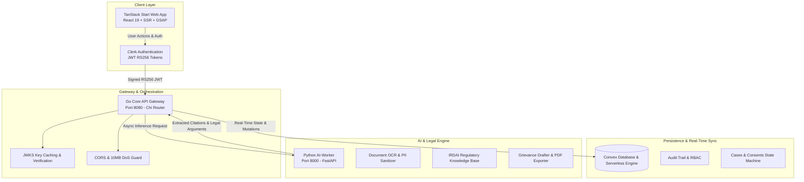

# BimaNyaya (बीमान्याय)

<div align="center">


### AI-Powered Insurance Grievance Redressal & Claim Dispute Resolution Platform

[](https://github.com/JayantShoundik/BimaNyaya/actions/workflows/ci.yml)
[](https://github.com/JayantShoundik/BimaNyaya/actions/workflows/docker-build.yml)
[](https://github.com/JayantShoundik/BimaNyaya/actions/workflows/codeql.yml)
[](LICENSE)
[](https://go.dev/)
[](https://react.dev/)
[](https://tanstack.com/start)
[](https://fastapi.tiangolo.com/)
[](https://convex.dev/)

[Features](#-key-features) • [Architecture](#-system-architecture) • [Tech Stack](#-tech-stack) • [Quickstart](#-getting-started) • [Testing](#-verification--testing) • [Documentation](#-documentation)

</div>

---

## 🌟 Overview

**BimaNyaya (बीमान्याय)** is an enterprise-grade, high-fidelity AI platform engineered to protect policyholders against unfair health insurance claim rejections, arbitrary room rent capping deductions, and proportionate deduction penalties.

By synthesizing **Optical Character Recognition (OCR)**, **Retrieval-Augmented Generation (RAG)** over IRDAI master circulars, **Deterministic Legal Rule Engines**, and **Multi-lingual LLM Drafting**, BimaNyaya democratizes insurance legal aid across India.

---

## 🏗 System Architecture

BimaNyaya operates on a decoupled, microservices-oriented monorepo architecture:



---

## ✨ Key Features

- **⚡ Instant Dispute Eligibility Engine**: Evaluates health insurance disputes against regulatory parameters, document readiness, and disputed value thresholds in sub-seconds.
- **📄 Multi-Engine OCR & Document Classifier**: Auto-categorizes rejection letters, discharge summaries, and hospital bills, extracting critical metadata with PII scrubbers.
- **⚖️ IRDAI Legal Compliance Knowledge Base**: Auto-retrieves exact clauses (e.g., IRDAI 2016 Proportionate Deduction Circulars & 2020 General Terms) prohibiting deductions on medicines, diagnostics, and implants.
- **📝 Automated Grievance Representation Drafting**: Generates formal, legally-sound representation letters addressed to Insurance Grievance Redressal Officers (GRO).
- **🌐 Multilingual Support**: Instantly translates representation letters into Hindi, Odia, and regional Indian languages.
- **👨‍⚖️ Reviewer Workspace & Audit Logs**: Full Role-Based Access Control (RBAC) with case queues, peer reviews, SLA tracking, and cryptographic audit trails.
- **📑 Production PDF Case Pack Export**: Compiles verified representations into signed, IRDAI-compliant PDF documents.

---

## 🛠 Tech Stack

| Layer | Technologies | Description |
|---|---|---|
| **Frontend Web** | React 19, TanStack Start, Vite, GSAP, TailwindCSS, Lucide | Obsidian Dark emerald UI with smooth animations and SSR |
| **Identity & Auth** | Clerk, RS256 JWKS Cache | Role-based authentication (`POLICYHOLDER`, `REVIEWER`, `ADMIN`) |
| **API Gateway** | Go 1.25+, go-chi, golang-jwt | High-throughput gateway, proxying, and validation |
| **Realtime Database** | Convex (`^1.42.0`) | Serverless transactional database, reactivity, and mutations |
| **AI Microservice** | Python 3.12+, FastAPI, PyMuPDF, fpdf2, Jinja2 | OCR pipeline, RAG retrieval, reasoning engine, and PDF export |
| **DevOps & CI/CD** | Docker, GitHub Actions, CodeQL, Dependabot | Multi-matrix automated builds and security scanning |

---

## 📂 Monorepo Structure

```text
├── .github/
│   ├── dependabot.yml       # Automated weekly dependency updates
│   └── workflows/
│       ├── ci.yml           # Multi-job test & build matrix
│       ├── docker-build.yml # Docker container build tests
│       ├── codeql.yml       # CodeQL SAST security scanning
│       └── release.yml      # Release packaging & tagging
├── apps/
│   ├── api/                 # Go Core API Gateway
│   │   ├── cmd/api/         # Entrypoint (main.go)
│   │   └── internal/        # Auth, Cases, Consents, Reviews, DB Clients
│   ├── ai-worker/           # Python AI Microservice (OCR, RAG, PDF)
│   │   ├── app/             # FastAPI App, Extraction, Reasoning, Safety
│   │   └── tests/           # Pytest test suite
│   └── web/                 # TanStack Start Web Application
│       ├── src/             # Routes, Components, Design Tokens
│       └── vitest.config.ts # Frontend unit testing config
├── convex/                  # Convex Schemas, Queries, Mutations, Actions
├── docs/                    # Architectural & Workflow Documentation
│   ├── ARCHITECTURE.md      # Comprehensive Architecture Blueprint
│   ├── API_REFERENCE.md     # REST & Convex API Specification
│   └── WORKFLOW_GUIDE.md    # Developer & Deployment Workflow Guide
├── docker-compose.yml       # Multi-container local orchestration
├── CONTRIBUTING.md          # Contribution & Code Style Guidelines
├── SECURITY.md              # Security Policy & Vulnerability Reporting
├── test_apis.sh             # E2E API Verification Script
└── test_reviewer_features.sh# Reviewer & PDF Export Verification Script
```

---

## 🚀 Getting Started

### 1. Prerequisites

- **Node.js** (v20+ or v22+) & **npm**
- **Go** (v1.25+)
- **Python** (v3.10+)
- **Docker & Docker Compose**

### 2. Environment Setup

Copy `.env.example` to `.env`:

```bash
cp .env.example .env
```

Configure your credentials:
```env
# Clerk Authentication
CLERK_SECRET_KEY=sk_test_...
CLERK_JWT_ISSUER=https://<your-app>.clerk.accounts.dev
CLERK_JWKS_URL=https://<your-app>.clerk.accounts.dev/.well-known/jwks.json
VITE_CLERK_PUBLISHABLE_KEY=pk_test_...

# Convex Deployment
CONVEX_URL=https://<your-app>.convex.cloud
```

### 3. Local Development

#### Start Frontend:
```bash
npm run dev
# Running on http://localhost:3000
```

#### Start Go API Gateway:
```bash
cd apps/api
go run cmd/api/main.go
# Running on http://localhost:8080
```

#### Start Python AI-Worker:
```bash
cd apps/ai-worker
uvicorn app.main:app --reload --port 8000
# Running on http://localhost:8000
```

#### Start All via Docker Compose:
```bash
docker-compose up --build -d
```

---

## 🧪 Verification & Testing

Run all unit and integration test suites across the monorepo in one command:

```bash
npm test
```

### Individual Service Testing

```bash
# Test Frontend (Vitest)
npm run test:web

# Test Go API Gateway
npm run test:api

# Test Python AI-Worker
npm run test:worker

# Run End-to-End API Integration Script
chmod +x test_apis.sh
./test_apis.sh

# Run Reviewer & PDF Export Flow Verification
chmod +x test_reviewer_features.sh
./test_reviewer_features.sh
```

---

## 📚 Documentation

For in-depth technical guides, explore the `docs/` repository:

- 🏛 **[Architecture & Design Blueprint](docs/ARCHITECTURE.md)**: Deep dive into microservices, data models, state machines, and RAG pipelines.
- 📡 **[API Reference Specification](docs/API_REFERENCE.md)**: Exhaustive documentation of all REST and Convex API endpoints.
- 🔄 **[Developer Workflow Guide](docs/WORKFLOW_GUIDE.md)**: Branch strategies, local simulation workflows, and CI/CD pipelines.
- 🤝 **[Contributing Guidelines](CONTRIBUTING.md)**: Contribution standards, code style, and PR requirements.
- 🛡 **[Security Policy](SECURITY.md)**: Security standards, threat model, and vulnerability reporting.

---

## 📄 License

This project is licensed under the MIT License - see the [LICENSE](LICENSE) file for details.