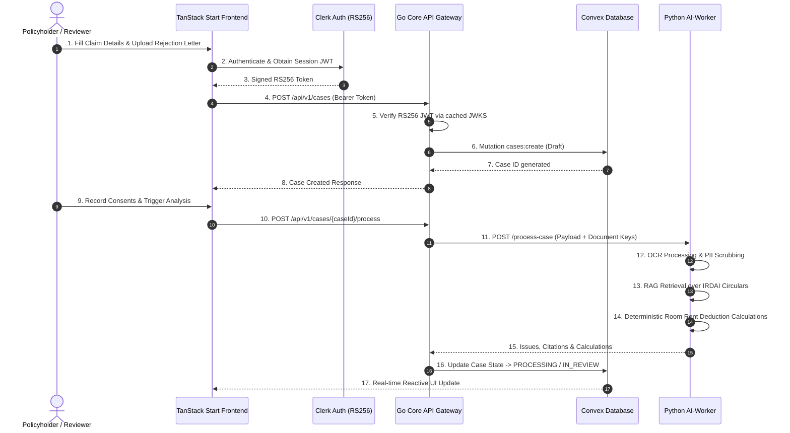
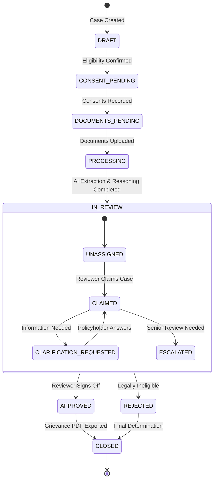

# BimaNyaya System Architecture Blueprint

## 1. Executive Architecture Summary

BimaNyaya is an AI-driven, regulatory-aware legal technology platform built to analyze health insurance claim disputes under Indian Insurance Regulatory and Development Authority (IRDAI) guidelines.

The system is architected as a decoupled monorepo composed of four primary layers:
1. **Frontend Presentation & Interaction**: TanStack Start with React 19, Server-Side Rendering (SSR), TailwindCSS, GSAP, and Lucide icons.
2. **API Gateway & Orchestration**: High-throughput Go (Chi router) service managing authentication (Clerk JWT via RS256 JWKS), request rate limiting, payload bounding, and cross-service proxying.
3. **Database & Real-time State Machine**: Convex serverless transactional database managing documents, cases, timelines, role-based access control (RBAC), and audit logs.
4. **Machine Learning & Legal Intelligence**: Python FastAPI worker pool performing document OCR, PII sanitization, IRDAI RAG citation retrieval, deterministic claim reasoning, multi-lingual translation, and PDF compilation.

---

## 2. End-to-End Dataflow & Sequence

---

## 3. Case State Machine Lifecycle

Every grievance case follows an immutable, transactional state transition model:

---

## 4. Legal Compliance & RAG Reasoning Engine

### The Proportionate Deduction Problem
In Indian health insurance, when a policyholder selects a hospital room exceeding their daily room rent limit (e.g., 1% of Sum Insured), insurers frequently apply a proportionate deduction across the **entire hospital bill**.

### IRDAI Master Circular Guardrails
- **IRDAI/HLT/REG/CIR/2016 (July 29, 2016)**: Explicitly prohibits proportionate deduction on **medicines, consumables, implants, medical devices, and diagnostic tests**. Deductions can only apply to service-oriented charges (room rent, nursing, OT, and doctor consultations).
- **Guidelines on Standardization (2020)**: Mandates standard room rent definitions and transparency in deduction formulas.

### AI Engine Implementation
1. **Extraction**: Analyzes hospital billing itemization and rejection notices.
2. **Classification**: Splits line items into **Associated Medical Expenses** vs **Non-associated Expenses** (Implants, Pharmacy, Diagnostics).
3. **Calculation**: Computes excess deductions illegally taken by the insurer:
   $$\text{Excess Deduction} = \text{Non-Associated Expenses} \times \left(1 - \frac{\text{Eligible Room Rent}}{\text{Actual Room Rent}}\right)$$
4. **Drafting**: Constructs formal legal representations citing exact paragraphs and binding circulars for submission to the Insurance Ombudsman or Grievance Officer.

---

## 5. Security Architecture & Threat Model

- **Zero-Trust Auth Token Verification**: All client calls are validated using Clerk RS256 asymmetric keys fetched from `CLERK_JWKS_URL` and cached in thread-safe memory with 60-second backoff.
- **Request Boundary Limits**: Global middleware limits incoming HTTP requests to 10MB to eliminate resource exhaustion attacks.
- **Strict CORS Allowlists**: Disallows wildcard CORS origins in production; validates against explicitly whitelisted domains.
- **PII Scrubbing**: Automatic regex detection and redaction of Aadhaar (12-digit) and PAN card numbers before document payloads reach LLM pipelines.
- **Immutable Audit Logging**: Every critical action (`CREATE`, `UPDATE`, `CLAIM`, `APPROVE`, `ESCALATE`) is recorded in Convex with actor metadata, timestamps, and cryptographic state hashes.
