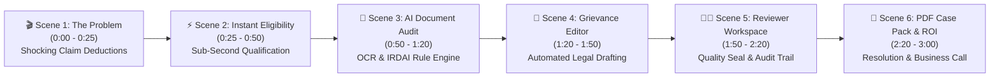
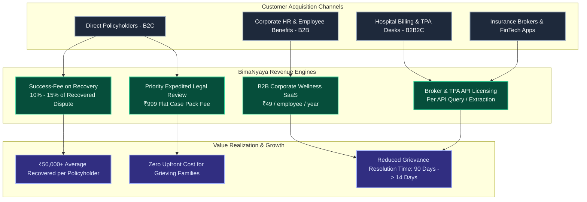
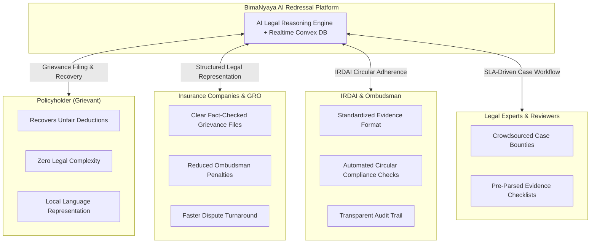

# BimaNyaya (बीमान्याय) — Video Demonstration Storyboard & Business Proposal Blueprint

This document provides visual workflow diagrams, a minute-by-minute video demonstration script, and a comprehensive business proposal tailored for investor presentations, stakeholder pitches, and promotional video production.

---

## 📑 Table of Contents
1. [Visual Workflow Diagrams](#1-visual-workflow-diagrams)
   - [Diagram 1: End-to-End Product Workflow](#diagram-1-end-to-end-product-workflow)
   - [Diagram 2: Video Demonstration Scene Sequence](#diagram-2-video-demonstration-scene-sequence)
   - [Diagram 3: Business Model & Revenue Flow](#diagram-3-business-model--revenue-flow)
   - [Diagram 4: Stakeholder Value Ecosystem](#diagram-4-stakeholder-value-ecosystem)
2. [Video Demonstration Script & Storyboard](#2-video-demonstration-script--storyboard)
3. [Business Proposal & Commercial Blueprint](#3-business-proposal--commercial-blueprint)
   - [Market Opportunity & Problem Statement](#market-opportunity--problem-statement)
   - [Regulatory Catalysts (IRDAI Moat)](#regulatory-catalysts-irdai-moat)
   - [Revenue Model & Unit Economics](#revenue-model--unit-economics)
   - [Go-To-Market (GTM) Strategy](#go-to-market-gtm-strategy)
   - [Product Roadmap](#product-roadmap)

---

# 1. Visual Workflow Diagrams

### Diagram 1: End-to-End Product Workflow

```mermaid
flowchart TD
    %% Styling
    classDef userLayer fill:#0d2818,stroke:#10b981,stroke-width:2px,color:#eafff4;
    classDef aiLayer fill:#0f172a,stroke:#38bdf8,stroke-width:2px,color:#f8fafc;
    classDef reviewLayer fill:#1e1b4b,stroke:#818cf8,stroke-width:2px,color:#ede9fe;
    classDef legalLayer fill:#2a1b0d,stroke:#f59e0b,stroke-width:2px,color:#fef3c7;

    subgraph INTAKE ["1. Policyholder Intake & Eligibility"]
        A[Policyholder Discovers Claim Deduction]:::userLayer
        B[Instant Eligibility Check Engine]:::userLayer
        C[Upload Rejection Letter & Hospital Bill]:::userLayer
        D[Record Explicit Consent & PII Scrubbing]:::userLayer
        A --> B --> C --> D
    end

    subgraph AI_PIPELINE ["2. AI & Legal Reasoning Engine"]
        E[Multi-Engine Document OCR]:::aiLayer
        F[Line-Item Itemizer & Deductions Classifier]:::aiLayer
        G[RAG Retriever: IRDAI Master Circulars 2016/2020]:::aiLayer
        H[Deterministic Room Rent Dispute Calculator]:::aiLayer
        I[Automated Grievance Representation Drafter]:::aiLayer
        D --> E --> F --> G --> H --> I
    end

    subgraph HUMAN_LOOP ["3. Human-in-the-Loop Review Hub"]
        J[Reviewer Queue & Case Claiming]:::reviewLayer
        K[Clinical & Regulatory Fact Check]:::reviewLayer
        L[Multi-Lingual Translation: Hindi/Odia/Regional]:::reviewLayer
        I --> J --> K --> L
    end

    subgraph REDRESSAL ["4. Redressal & Resolution Execution"]
        M[IRDAI-Compliant PDF Case Pack Generation]:::legalLayer
        N[Submission to Insurer Grievance Redressal Officer - GRO]:::legalLayer
        O[Escalation to Insurance Ombudsman / Bima Bharosa]:::legalLayer
        P[Claim Underpayment Recovery & Settlement]:::legalLayer
        L --> M --> N --> O --> P
    end
```



---

### Diagram 2: Video Demonstration Scene Sequence



---

### Diagram 3: Business Model & Revenue Flow



---

### Diagram 4: Stakeholder Value Ecosystem



---

# 2. Video Demonstration Script & Storyboard

### **Video Title**: *BimaNyaya — Restoring Justice to Insurance Claim Disputes*
**Target Duration**: 3 Minutes (180 Seconds)  
**Tone**: Authoritative, Empathetic, High-Tech, Professional  
**Visual Style**: Obsidian Dark UI, Mint-Emerald Accents, Glassmorphism, Animated Data Callouts

---

### **Scene 1: The Problem (0:00 – 0:25)**
- **Visual**: Dark screen fade-in. A distraught policyholder looking at a hospital discharge bill of ₹2,50,000 where the insurer only paid ₹1,30,000. Bold red callout: *"Deduction: ₹1,20,000 (Room Rent Proportionate Penalty)"*.
- **Motion Graphic**: Highlight clause 1.A from policy and unfair 50% deductions applied to medicines, syringes, and surgical implants.
- **Voiceover (VO)**: 
  > *"Every year in India, over 1 crore health insurance claims face arbitrary deductions. When patients choose a room slightly above their capping limit, insurance companies often slash 50% off their entire hospital bill — including medicines, surgery implants, and diagnostics. This is not just unfair — under IRDAI regulations, it is illegal."*
- **On-Screen Text**: *₹15,000 Cr+ Lost by Indian Families in Unfair Deductions Annually.*

---

### **Scene 2: Introducing BimaNyaya & Instant Eligibility (0:25 – 0:50)**
- **Visual**: Screen transition to **BimaNyaya Landing Page** with glowing Voronoi cells and mint-emerald badge.
- **UI Flow**: User clicks **"Check Claim Eligibility"**. Form inputs: Health Insurance, Partially Settled, Disputed Amount: ₹60,000.
- **Interactive Action**: Instant green badge appears: `ELIGIBLE under IRDAI 2016 Proportionate Deduction Circular`.
- **VO**: 
  > *"Meet BimaNyaya — India’s first AI-powered insurance grievance redressal platform. In just 30 seconds, our deterministic eligibility engine analyzes your claim facts against current IRDAI master circulars and confirms your legal ground for dispute."*
- **On-Screen Text**: *Instant Qualification • Zero Jargon • 100% Free Eligibility Check.*

---

### **Scene 3: Multi-Engine Document Extraction & RAG Audit (0:50 – 1:20)**
- **Visual**: User drags and drops a PDF rejection letter and hospital itemized summary into the **Vault Upload**.
- **UI Flow**: Dynamic progress visualization shows OCR processing, PII redaction of Aadhaar/PAN, line-item classification, and RAG knowledge retrieval.
- **Screen Highlight**: Zoom-in on the extracted calculation card:
  - *Non-Associated Expenses (Medicines/Implants): ₹70,000*
  - *Illegal Deduction by Insurer: ₹35,000*
  - *IRDAI Rule Applied: Circular IRDAI/HLT/REG/CIR/2016, Clause 6.1*
- **VO**: 
  > *"Our multi-engine OCR securely processes hospital bills and rejection letters, redacts personal identity data, and breaks down line-items. It separates service charges from medicines and implants, instantly calculating the exact amount the insurer owes you under the law."*

---

### **Scene 4: Automated Legal Drafting & Regional Translation (1:20 – 1:50)**
- **Visual**: Switch to the **Grievance Editor Screen**.
- **UI Flow**: A fully formatted, formal legal representation letter addressed to the Grievance Redressal Officer (GRO) appears automatically.
- **Interactive Action**: User clicks the **Translate** dropdown and selects **"हिंदी (Hindi)"**. The entire letter converts seamlessly with appropriate legal terminology.
- **VO**: 
  > *"No expensive lawyers or confusing legal notices needed. BimaNyaya auto-generates a comprehensive, legally cited representation letter. With one click, policyholders can translate the grievance into regional Indian languages including Hindi and Odia."*
- **On-Screen Text**: *Automated Legal Drafting • Multilingual Regional Support • TipTap Interactive Editor.*

---

### **Scene 5: Expert Reviewer Hub & Audit Trail (1:50 – 2:20)**
- **Visual**: Transition to the **Reviewer Portal & SLA Operations Dashboard**.
- **UI Flow**: Certified insurance legal expert logs in, claims the case from the queue, verifies the evidence checklist, adds clinical review comments, and signs off.
- **Screen Highlight**: Convex-powered real-time status updates from `PROCESSING` to `IN_REVIEW` to `APPROVED`.
- **VO**: 
  > *"Behind our AI is a human-in-the-loop network of certified insurance legal reviewers. Every representation undergoes rigorous fact-checking and SLA tracking, guaranteeing the highest standard of legal precision before submission."*

---

### **Scene 6: PDF Case Pack Export & Commercial Impact (2:20 – 3:00)**
- **Visual**: The policyholder downloads the official **BimaNyaya Grievance Case Pack PDF**, featuring IRDAI circular citations, claim breakdown tables, and submission instructions.
- **Screen Highlight**: Quick montage of B2C recovery, Corporate HR employee benefits dashboard, and insurer settlement notification.
- **Closing Visual**: BimaNyaya logo with tagline: *Nyaya Har Policyholder Ke Liye (Justice for Every Policyholder)*.
- **VO**: 
  > *"From unfair deduction to full settlement in minutes. BimaNyaya bridges the gap between policyholders and insurance justice. Try BimaNyaya today and reclaim what is rightfully yours."*
- **Call to Action**: *Visit bimanyaya.in | GitHub: github.com/Rekha-1kumari/clonerC*


---

# 3. Business Proposal & Commercial Blueprint

## Executive Summary
**BimaNyaya** is an InsurTech & LegalTech platform designed to resolve health insurance claim underpayments and unfair deductions in India. By leveraging state-of-the-art AI document processing, deterministic regulatory engines, and human-in-the-loop review, BimaNyaya turns complex insurance disputes into structured, recoverable claims within minutes.

---

## Market Opportunity & Problem Statement

| Metric | Industry Figure | Market Impact |
|---|---|---|
| **Total Health Claims Filed (India)** | 4.5+ Crore claims / year | Growing at 22% CAGR post-pandemic |
| **Average Claim Rejection / Dispute Rate** | 18% – 22% of claims | Over 80 Lakh families face underpayment |
| **Average Deduction per Dispute** | ₹25,000 – ₹1,20,000 | Excessive burden on middle-class families |
| **Total Addressable Market (TAM)** | **₹18,000 Crore+** ($2.2B) | Total value of disputed insurance deductions annually |
| **Serviceable Addressable Market (SAM)** | **₹3,600 Crore** ($440M) | Digitally accessible health insurance policyholders |
| **Serviceable Obtainable Market (SOM)** | **₹360 Crore** ($44M) | 10% market share within 3 years |

---

## Regulatory Catalysts (The IRDAI Moat)

BimaNyaya’s AI engine is built directly on binding statutory regulations that insurers often fail to comply with at the ground level:

1. **IRDAI Proportionate Deduction Circular (2016)**: Prohibits proportionate deductions on pharmacy, medical consumables, diagnostic tests, and surgical implants when room rent limits are exceeded.
2. **IRDAI Standardization Guidelines (2020)**: Mandates standardized definition of associate medical expenses and room rent schedules.
3. **IRDAI 100% Cashless Health Insurance Mandate (2024)**: Pushes hospitals and insurers toward standardized digital dispute resolution protocols.
4. **Insurance Ombudsman Act (2017)**: Requires insurers to respond to formal representations within 30 days before statutory penalties apply.

---

## Revenue Model & Unit Economics

BimaNyaya operates a diversified, high-margin revenue model across B2C, B2B, and B2B2C channels:

```text
┌────────────────────────────────────────────────────────────────────────┐
│                      BIMANYAYA REVENUE STREAMS                         │
├───────────────────┬───────────────────┬────────────────────────────────┤
│ 1. Success-Fee    │ 2. B2B Corporate  │ 3. Broker & TPA API            │
│    (B2C Claims)   │    Employee Cover │    Licensing (SaaS)            │
│ 12% of Recovered  │ ₹49 / employee /  │ ₹150 per automated case audit  │
│ Dispute Value     │ year corporate    │ & document extraction query    │
└───────────────────┴───────────────────┴────────────────────────────────┘
```

### Unit Economics (Per Resolved B2C Case)
- **Average Claim Dispute Value**: ₹50,000
- **Average Recovered Settlement**: ₹32,000 (64% recovery rate)
- **BimaNyaya Success Fee (12%)**: **₹3,840**
- **Customer Acquisition Cost (CAC)**: ₹650 (Content, SEO, Hospital desk partnerships)
- **AI Infrastructure & OCR Cost**: ₹45 (Sarvam OCR + Cloud compute)
- **Human Reviewer Bounty**: ₹500
- **Net Contribution Margin**: **₹2,645 (68.8% Gross Margin)**
- **LTV / CAC Ratio**: **4.1x**

---

## Go-To-Market (GTM) Strategy

```text
Phase 1 (Months 1-6)    ──> Direct B2C via Organic SEO & Grievance Guides
Phase 2 (Months 6-12)   ──> Hospital TPA Desk & Billing Counter Partnerships
Phase 3 (Months 12-18)  ──> B2B Corporate Wellness & Employee Benefits Integrations
Phase 4 (Months 18-24)  ──> Enterprise FinTech & Insurance Broker API Licensing
```

1. **Organic Legal Content & Claim Calculators**: SEO dominance for high-intent search queries (`"Star Health room rent deduction"`, `"Niva Bupa proportionate deduction rule"`).
2. **Hospital Discharge Counter Integration**: Co-branded leaflets and QR codes at hospital billing desks where patients discover sudden out-of-pocket deductions.
3. **Corporate HR Benefit Portals**: Offering BimaNyaya as a subsidized employee assistance benefit to reduce employee stress during family medical emergencies.
4. **FinTech Partnerships**: Embedding claim recovery widgets inside health-tech and personal finance apps (CRED, PhonePe, PolicyBazaar).

---

## Product Roadmap

- [x] **Q1 2026**: Core Platform Launch (Health Claims, Proportionate Deduction Engine, TanStack Web App, Go Gateway, Python RAG Worker, Convex Realtime Database).
- [ ] **Q2 2026**: Mobile Native App (React Native) with Camera Scan OCR and WhatsApp Bot Grievance Assistant.
- [ ] **Q3 2026**: Automated Direct E-Filing Integration with IRDAI **Bima Bharosa** Portal & Insurance Ombudsman CMS.
- [ ] **Q4 2026**: Expansion to Motor Insurance (depreciation deductions) and Life Insurance (repudiated death claims).
- [ ] **Q1 2027**: Enterprise TPA Pre-Dispute Audit API for cashless hospital approvals.

---

## Contact & Investment Inquiries

- **Platform URL**: [https://bimanyaya.in](https://bimanyaya.in)
- **GitHub Repository**: [https://github.com/Rekha-1kumari/clonerC](https://github.com/Rekha-1kumari/clonerC)
- **Founder & Maintainer**: Rekha Kumari
- **Email**: contact@bimanyaya.in / rekha@bimanyaya.in

