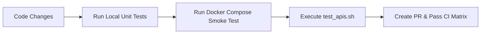

# BimaNyaya Developer & Deployment Workflow Guide

This guide outlines standard operational workflows for development, testing, CI/CD automation, and production deployment in the BimaNyaya monorepo.

---

## 1. Branching & Git Strategy

We follow a structured **Trunk-Based / GitFlow Hybrid** branching strategy:

- `main`: Production-ready code. All commits trigger release validation and security scans.
- `develop`: Integration branch for completed feature branches.
- `feat/<feature-name>`: Dedicated branch for new features or UI components.
- `fix/<issue-name>`: Dedicated branch for bug fixes.
- `chore/<task-name>`: Maintenance, dependency updates, and documentation.

### Conventional Commit Standards
All commits must adhere to the Conventional Commits specification:
```text
feat(web): add voronoi background shader support
fix(api): address JWKS cache race condition on key rotation
test(worker): add pytest coverage for room rent calculations
docs(readme): update system architecture diagrams
```

---

## 2. Local Development Cycle



### 1. Make Code Changes
Develop frontend components in `apps/web`, backend endpoints in `apps/api`, or AI logic in `apps/ai-worker`.

### 2. Verify Across All Test Suites
```bash
# Runs Web (Vitest), Go (go test), and Python (pytest)
npm test
```

### 3. Verify Local Microservices via Docker
```bash
docker-compose up -d --build
```

### 4. Run End-to-End API Verification
```bash
./test_apis.sh
./test_reviewer_features.sh
```

---

## 3. Continuous Integration & Deployment (CI/CD)

Our GitHub Actions pipeline (`.github/workflows/ci.yml`) executes on every Pull Request:

1. **Frontend Job**:
   - `npm ci`
   - `npx tsc --noEmit` (Type Checking)
   - `npm run test` (Vitest Unit & Component Tests)
   - `npm run build` (Client + SSR Bundles)
2. **Go API Gateway Job**:
   - `go mod download`
   - `go vet ./...`
   - `go test -v -race ./...` (Unit tests with race detector)
   - `go build -v ./cmd/api`
3. **Python AI-Worker Job**:
   - `pip install -r requirements.txt`
   - `pytest -v` (Full suite with mock fallbacks)
4. **Convex Validation Job**:
   - Validates schema, queries, mutations, and actions type safety.

---

## 4. Production Deployment Checklist

1. **Environment Variables**:
   - Set `ENV=production`
   - Configure live Clerk Secret Key, Issuer, and JWKS URL.
   - Configure production Convex deployment URL (`CONVEX_URL`).
   - Configure Sarvam AI Key (`SARVAM_API_KEY`) for Indian language OCR.
2. **CORS Hardening**:
   - Update `CORS_ALLOWED_ORIGINS` to include only verified production domains (e.g., `https://bimanyaya.in`).
3. **Container Registry**:
   - Build and tag production images:
     ```bash
     docker build -t registry.example.com/bimanyaya-api:latest ./apps/api
     docker build -t registry.example.com/bimanyaya-worker:latest ./apps/ai-worker
     ```
